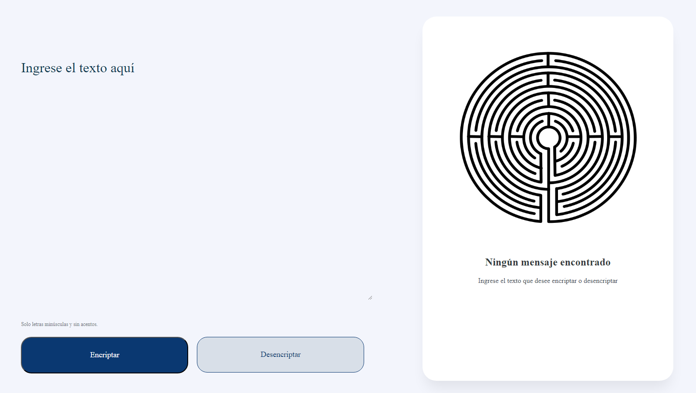

# 💎 CryptoWebApp 💎

## Bienvenido a **CryptoWebApp** 🚀

¡Cifrado y descifrado Cesar de mensajes de texto con HTML, CSS, JavaScript! 🕵️‍♂️

---

### Características ✨

- 🔒 Cifrado y descifrado de mensajes con el Cifrado César.
- 🖥️ Interfaz de usuario intuitiva y fácil de usar.
- 🔄 Responsive design.
- ⚠️ Sweet alerts.

---

## 🚀 Cómo Usar

1. 📝 Ingresa tu mensaje en el campo correspondiente.
2. ⚡ Selecciona "Encriptar" o "Desencriptar".
3. 🎉 ¡Voilà! Tu mensaje ha sido mágicamente cifrado o descifrado.

---

## 🌐 Demostración en Vivo

